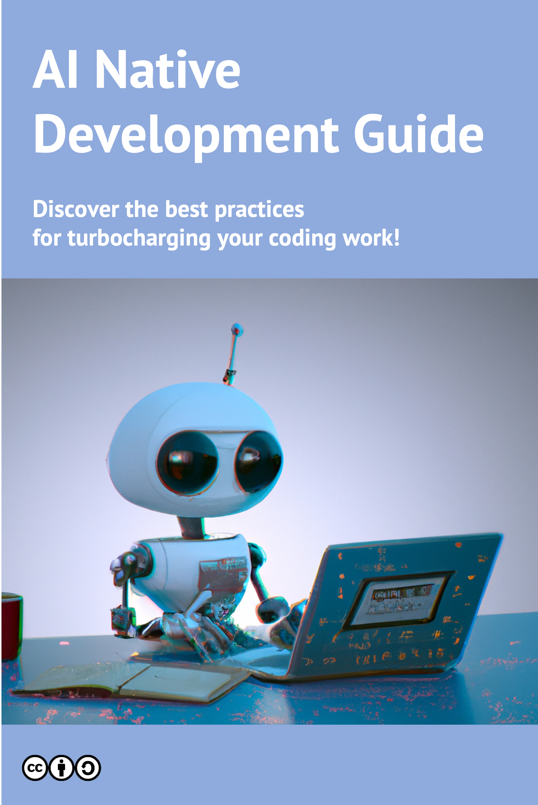

# AI-Native Development Guide

Willkommen beim AI-Native Development Guide!
Dies ist ein Community-Dokument, das von der AI-Native Development Community betrieben wird.
In diesem Dokument haben wir bewährte Verfahren für die AI-Native-Entwicklung unter Verwendung von Tools wie GitHub Copilot in einem spezifischen Format zusammengestellt, damit Sie sie leicht verstehen, bewerten und auf Ihre Situation anwenden können.
Einige sind gruppiert und als Muster bezeichnet. Wir wären begeistert, wenn du unserem [GitHub-Repository](https://github.com/AI-Native-Development/docs) einen Stern geben oder auf irgendeine Weise einen Beitrag leisten könntest, egal wie klein. Lass uns gemeinsam den Weg für die AI-Native-Entwicklung ebnen!

Einige dieser Muster haben sich in individuellen Umgebungen als wirksam erwiesen, während andere ideenbasiert sind und noch nicht auf ihre Wirksamkeit in tatsächlichen Teamumgebungen getestet wurden.
Bitte hinterlassen Sie Kommentare auf GitHub Issues.
Wir freuen uns auf verschiedene Diskussionen und den Austausch von Wissen über die AI-Native-Entwicklung.

In dieser Einführung werden wir erklären, was AI-Native-Entwicklung ist und was Muster sind.
Wenn Sie bereits AI-Native-Entwicklung in Ihrem Unternehmen praktizieren und Ihre Erfahrung zu diesem Dokument beitragen möchten, begrüßen wir Ihren Beitrag!

Aktuell unterstützen wir die folgenden Sprachen: [Englisch 🇺🇸](https://ai-native-development.gitbook.io/docs/), [Deutsch 🇩🇪](https://ai-native-development.gitbook.io/docs/v/de/), [Spanisch 🇪🇸](https://ai-native-development.gitbook.io/docs/v/es/), [Französisch 🇫🇷](https://ai-native-development.gitbook.io/docs/v/fr/), [Italienisch 🇮🇹](https://ai-native-development.gitbook.io/docs/v/it/), [Japanisch 🇯🇵](https://ai-native-development.gitbook.io/docs/v/ja/), [Portugiesisch 🇵🇹](https://ai-native-development.gitbook.io/docs/v/pt/) und [Chinesisch 🇨🇳](https://ai-native-development.gitbook.io/docs/v/zh/).


Dieses Dokument "AI-Native Development Guide" ist noch nicht in seiner endgültigen Version und es können defekte Links, Tippfehler und andere Fehler enthalten sein.
Ihre Hilfe bei der Verbesserung wird sehr geschätzt.
Bitte sehen Sie, wie Sie zu diesem Dokument beitragen können.


## Was ist AI-Native-Entwicklung

AI-Native-Entwicklung ist ein Ansatz zur Beschleunigung der Softwareentwicklung durch Integration eines Entwicklungsprozesses und einer Kultur, die auf Zusammenarbeit mit AI basieren.
In der AI-Native-Entwicklung werden AI-Technologien wie GitHub Copilot und ChatGPT verwendet, um traditionelle Softwareentwicklungsprozesse erheblich zu vereinfachen und innovative Lösungen zu schaffen.

* Schnelle Codevervollständigung und Vorschläge: AI-Tools generieren und schlagen automatisch relevante Code-Snippets und Funktionen auf der Grundlage des von Entwicklern eingegebenen Codes vor.
Dies ermöglicht es Entwicklern, schnell Code zu schreiben und häufige Codierungsfehler und Bugs zu vermeiden.
* Beratung in natürlicher Sprache: AI-Tools können Code generieren und Lösungen auf Fragen und Anweisungen in natürlicher Sprache vorschlagen.
Dies ermöglicht es Entwicklern, die Absicht und Funktionalität ihres Programms einfach zu kommunizieren.

Auf der anderen Seite ist es erforderlich zu erwähnen, dass sich der Entwicklungsstil mit der Einführung der AI-Native-Entwicklung erheblich ändert.
Während viele Vorteile durch die Verwendung von AI-Technologien erzielt werden können, müssen Entwickler und Teams die folgenden Punkte beachten, um sich an diese Änderungen anzupassen.

* Lernen und Anpassung: Um AI-Tools und -Technologien effektiv zu nutzen, müssen Entwickler ihre Nutzung und Merkmale erlernen und anpassen.
Dies umfasst nicht nur das Beherrschen der grundlegenden Operationen und bewährten Verfahren der Tools, sondern auch das Verständnis, wie sie in den Entwicklungs prozess integriert werden und wie sie mit dem Team zusammenarbeiten können.
* Änderungen im Kommunikationsstil: In der AI-Native-Entwicklung müssen Entwickler von der traditionellen, codezentrierten Kommunikation auf Kommunikation in natürlicher Sprache umstellen.
Dies erfordert von Entwicklern, neue Fähigkeiten zu erwerben, um die Absicht und Anforderungen eines Projekts klar zu kommunizieren.
Dokumentation muss in einem Format bereitgestellt werden, das für AI leicht lesbar ist, indem man sich von traditionellen PowerPoint- und Excel-Formaten zu Dateitypen wie Markdown wechselt.
* Rollen und Verantwortlichkeiten im Team: Mit der Einführung der AI-Native-Entwicklung können sich die Rollen und Verantwortlichkeiten von Entwicklern und Teams neu definieren.
Dies erfordert von Entwicklern, flexibel in ihren Fachgebieten und Rollen zu sein und die Zusammenarbeit im Team zu stärken.
Entwickler werden erwartet, sich stärker auf fortgeschrittene Problemlösungen und strategische Entscheidungen zu konzentrieren, da Aufgaben durch den Einsatz von AI-Tools automatisiert werden.

Durch eine angemessene Integration von AI in die Entwicklung können Entwickler und Teams die Qualität und Effizienz ihrer Produkte/Projekte verbessern.
Wir hoffen, dass dieser Leitfaden für Sie ein Ausgangspunkt für den Einstieg in die Welt der AI-Native-Entwicklung sein wird.

## Was sind Muster

Muster sind eine Möglichkeit, wiederholbare Lösungen für Probleme in einem bestimmten Kontext zu beschreiben.
In der AI-Native-Entwicklung bieten Muster Ideen, wie Entwickler und Teams AI verwenden können, um eine schnelle Produktentwicklung zu erreichen.
Muster sind in Hauptabschnitte wie Titel, Problemdefinition, Kontext, Einflussfaktoren und Lösungen unterteilt.
Das Musterformat ist nützlich, um bewährte Lösungen zu beschreiben, kann aber auch verwendet werden, um beim Brainstorming neuer Lösungen für Muster, die noch nicht etabliert wurden, zu helfen.
Dies liegt daran, dass die Struktur der Muster einen Rahmen für das strukturierte Nachdenken über Probleme bietet.

Viele Muster sind in diesem Stadium noch in den Anfängen.
Wir ermutigen Sie, sie auszuprobieren und Feedback zu geben.
Wenn Sie ein neues Muster entdecken, lassen Sie es uns bitte über GitHub Issues wissen.
Wir freuen uns auf Ihre Beiträge!

## LIZENZ

AI-Native Development Guideline steht unter der [Creative Commons Attribution-ShareAlike 4.0 International](http://creativecommons.org/licenses/by-sa/4.0/) Lizenz.
