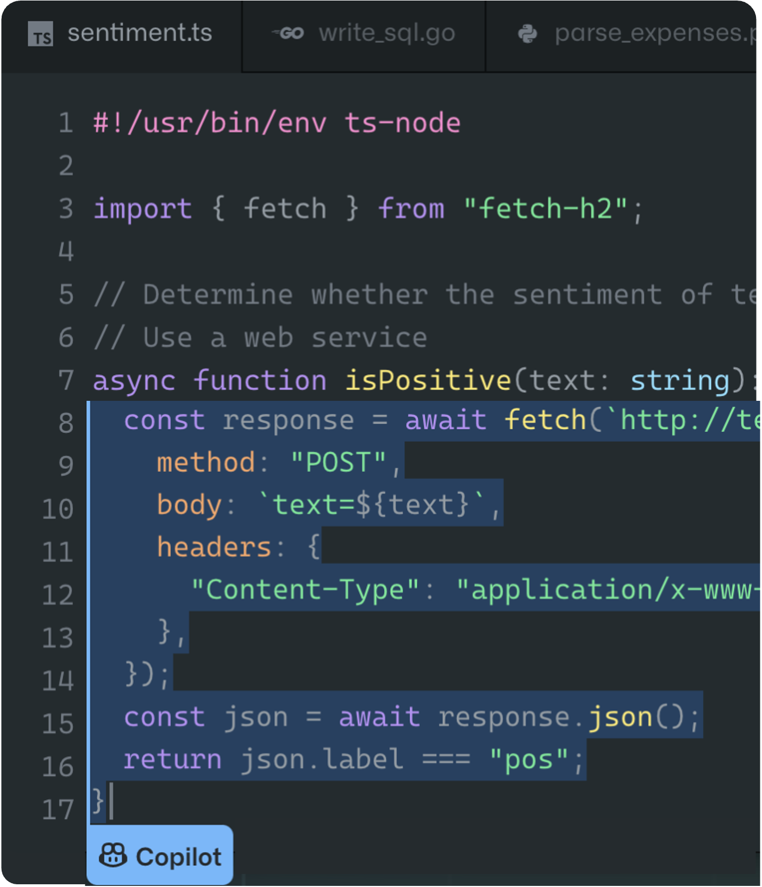
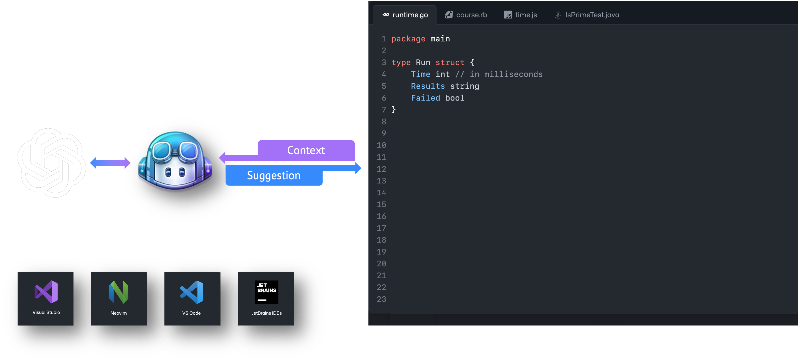
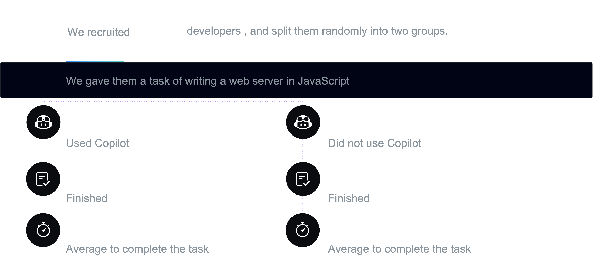
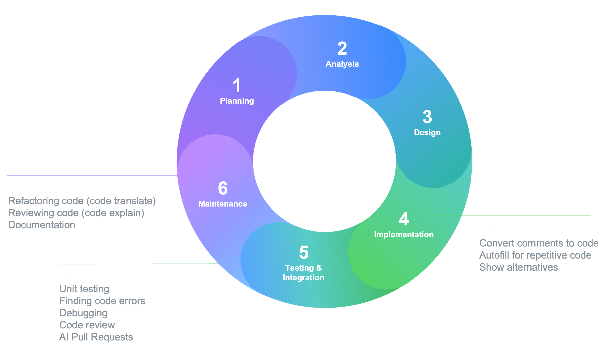
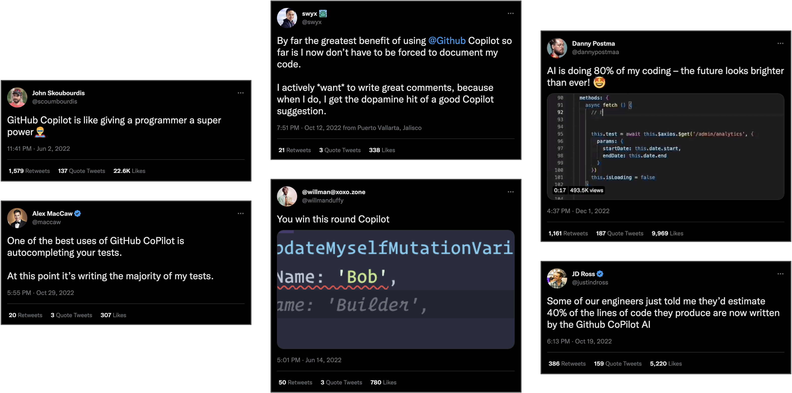

<!--
_paginate: false
_footer: ""
class: invert
-->

# GitHub Copilot 
# Patterns & Exercise


Getting Started with GitHub Copilot

---
<!--
_class: list
-->

## Table of Contents

- **About GitHub Copilot**
- **GitHub Copilot Patterns and Exercises**
  - General
  - Client Tips
  - Collaboration
  - Design Pattern
  - Refactoring
  - Testing

---

# About GitHub Copilot

---
<!--
_class: list
-->


## What is GitHub Copilot?

- AI-powered paired programming assistant
- Developed by GitHub and OpenAI
- Uses machine learning models to suggest code snippets



---
<!-- _class: invert, only-image -->

## How GitHub Copilot works



---
<!--
_class: list
-->

## Benefits of using GitHub Copilot


- Faster coding
- Improved accuracy
- Learning tool
- Less time writing the simple stuff

---
<!--
_class: list
-->

## GitHub Copilot Benefit



---

## GitHub Copilot Today and Tomorrow



---

## Reactions on GitHub Copilot



---

# GitHub Copilot Patterns

---
<!--
footer: "GitHub Copilot Patterns"
class: description
-->

## What is GitHub Copilot Patterns

### **Patterns are a way of describing a repeatable, proven solution to a problem within a context.** This document helps any engineer get along with GitHub Copilot by summarizing each engineer's abstract know-how as a pattern

---
<!-- _class: example -->
## General

- Code to Comment
- Language Translation
- Comment to Code
- Quick Q&A
- Code to Document
- Code Completion
- Object Generation from Structured Data
- Regular Expression
- Type Hinting
- Showing Examples


---
<!-- 
_class: "title"
_footer: "GitHub Copilot Patterns - Code to Comment"
_header: "General"
-->
## Code to Comment

Generating comments from code


---
<!-- 
_class: "description"
_footer: "GitHub Copilot Patterns - Code to Comment"
_header: "General"
-->
## Code to Comment

### Description


GitHub Copilot can generate comments from code. When existing code lacks sufficient comments, or to assist other developers in understanding the code, GitHub Copilot can automatically generate explanations in comment form. The following sample demonstrates the Sieve of Eratosthenes algorithm to list prime numbers less than a given number. While this code does not contain comments, GitHub Copilot can create comments to describe the code's functionality.

---
<!-- 
_class: "example"
_footer: "GitHub Copilot Patterns - Code to Comment"
_header: "General"
-->
## Code to Comment

### Example


Here's the code without comments:

```python
def eratosthenes_sieve(n):
    primes = []
    sieve = [True] * (n + 1)
    for p in range(2, n + 1):
        if sieve[p]:
            primes.append(p)
            for i in range(p * p, n + 1, p):
                sieve[i] = False
    return primes
```

Here's how GitHub Copilot can add comments to explain it:

```python
# Write the description of the method here <- [Actual Prompt]
# Input: n - the number of primes to return
# Output: a list of the first n primes
# Example: eratosthenes_sieve(5) -> [2, 3, 5, 7, 11]
# Note: this is a very inefficient way to find primes, but it is easy to understand
def eratosthenes_sieve(n):
    primes = []
    sieve = [True] * (n + 1)
    for p in range(2, n + 1):
        if sieve[p]:
            primes.append(p)
            for i in range(p * p, n + 1, p):
                sieve[i] = False
    return primes
```

---
<!-- 
_class: "exercise"
_footer: "GitHub Copilot Patterns - Code to Comment"
_header: "General"
-->
## Code to Comment

### Exercise


- **Exercise**: Generate appropriate comments for the code at the top of the following function:
  ```python
  def eratosthenes_sieve(n):
      primes = []
      sieve = [True] * (n + 1)
      for p in range(2, n + 1):
          if sieve[p]:
              primes.append(p)
              for i in range(p * p, n + 1, p):
                  sieve[i] = False
      return primes
  ```

---
<!-- 
_class: "checklist"
_footer: "GitHub Copilot Patterns - Code to Comment"
_header: "General"
-->
## Code to Comment

### Checklist for Further Learning


- Do the generated comments adequately explain the code's functionality and algorithm?
- Are the comments helpful for other developers to understand the code?
- What do you think could be the reason for any incorrect comments that were generated?

---
<!-- 
_class: "title"
_footer: "GitHub Copilot Patterns - Language Translation"
_header: "General"
-->
## Language Translation

GitHub Copilot translates your code into another programming language, Such as Python to JavaScript, and HTML to Markdown.


---
<!-- 
_class: "description"
_footer: "GitHub Copilot Patterns - Language Translation"
_header: "General"
-->
## Language Translation

### Description


Sometimes, developers may need to translate code from one language to another, such as from Python to JavaScript or HTML to Markdown. This is where GitHub Copilot shines as a virtual aide. Imagine a scenario where a team is working on a multi-platform project, and they need to quickly convert a Python algorithm into JavaScript for web integration. GitHub Copilot's Language Translation ability can save hours of manual translation, enabling seamless cross-language development.

---
<!-- 
_class: "example"
_footer: "GitHub Copilot Patterns - Language Translation"
_header: "General"
-->
## Language Translation

### Example


Here's an example of translating a Python function into JavaScript:

Python code:

```python
def add(a, b):
    return a + b
```

Using GitHub Copilot, we can effortlessly translate it into JavaScript:

```javascript
function add(a, b) {
    return a + b;
}
```

---
<!-- 
_class: "exercise"
_footer: "GitHub Copilot Patterns - Language Translation"
_header: "General"
-->
## Language Translation

### Exercise


- **Exercise 1**: Translate a simple HTML structure into Markdown using GitHub Copilot.
- **Exercise 2**: Convert a given Python class into its equivalent Java representation.
- **Exercise 3**: Write a C# function and then translate it into Ruby using GitHub Copilot.

---
<!-- 
_class: "checklist"
_footer: "GitHub Copilot Patterns - Language Translation"
_header: "General"
-->
## Language Translation

### Checklist for Further Learning


- How can GitHub Copilot be further optimized to provide more accurate translations between specific languages?
- What are the limitations, if any, when translating code from one language to another with GitHub Copilot?
- How can I utilize GitHub Copilot in collaborative environments to make cross-language projects more efficient?
 What are the differences between using GitHub Copilot and GitHub Copilot Chat?

---
<!-- 
_class: "title"
_footer: "GitHub Copilot Patterns - Comment to Code"
_header: "General"
-->
## Comment to Code

Generate code from comments with GitHub Copilot


---
<!-- 
_class: "description"
_footer: "GitHub Copilot Patterns - Comment to Code"
_header: "General"
-->
## Comment to Code

### Description


GitHub Copilot is capable of generating new code based on the specific text provided by a developer. By defining conditions in the form of comments, GitHub Copilot can create code that responds to the requirements.

---
<!-- 
_class: "example"
_footer: "GitHub Copilot Patterns - Comment to Code"
_header: "General"
-->
## Comment to Code

### Example


Here's a way to instruct GitHub Copilot to create a function through comments:

```javascript
// Function name: calculateAverage
// Function arguments: numbers (array)
// Return type of the function: number
```

Based on these comments, Copilot might suggest the following code:

```javascript
function calculateAverage(numbers: number[]): number {
    // calculate the average of the array
    const sum = numbers.reduce((a, b) => a + b);
    return sum / numbers.length;
}
```

---
<!-- 
_class: "checklist"
_footer: "GitHub Copilot Patterns - Comment to Code"
_header: "General"
-->
## Comment to Code

### Checklist for Further Learning


- Is the generated code based on the specified conditions?
- Is the functionality of the code correctly implemented?
- What is the appropriate way to write comments for more complex condition definitions?
- To give more context, try using the OS dictation functionality as well as the keyboard.

---
<!-- 
_class: "title"
_footer: "GitHub Copilot Patterns - Quick Q&A"
_header: "General"
-->
## Quick Q&A

Getting the quick answer to your question.


---
<!-- 
_class: "description"
_footer: "GitHub Copilot Patterns - Quick Q&A"
_header: "General"
-->
## Quick Q&A

### Description


In the collaborative coding environment, quick interactions and clarifications are often key to efficient development. While GitHub has the "GitHub Copilot Chat" product for more structured and extensive conversations, the "Quick Q&A" technique serves as a lightweight alternative. It enables developers to rapidly engage with Copilot in the code editor for brief one-liner answers and insights. It's not a distinct feature but a method that leverages commenting for quick interactions with Copilot, making it an agile and handy tool for on-the-spot guidance.

---
<!-- 
_class: "example"
_footer: "GitHub Copilot Patterns - Quick Q&A"
_header: "General"
-->
## Quick Q&A

### Example


Using the Quick Chat technique, you can pose questions directly in your code and get brief responses from Copilot:

```rb
# me: What's the best way to optimize this loop?
# copilot: 
```

Then GitHub Copilot will answer to the question

```rb
# me: What's the best way to optimize this loop?
# copilot: Consider using a vectorized approach or caching intermediate results. 
```

It can be just "q:" and "a:"

```javascript
// q: How do I get the current time in milliseconds?
// a: 
```

For more context-based dialogue, roles can be defined:

```rb
# Roles: copilot
#   Expert in Python with 15+ years of experience
# Role: me
#   Mid-level engineer
#
# me: What's the best way to optimize this loop?
# copilot: Consider using a vectorized approach or caching intermediate results. 
```

---
<!-- 
_class: "exercise"
_footer: "GitHub Copilot Patterns - Quick Q&A"
_header: "General"
-->
## Quick Q&A

### Exercise


- **Exercise 1**: Compare Quick Chat with "copilot chat" by engaging with both and noting the differences.
- **Exercise 2**: Use Quick Chat to get one-liner answers to three different coding questions.
- **Exercise 3**: Define roles within Quick Chat and observe how contextual information affects Copilot's responses.

---
<!-- 
_class: "checklist"
_footer: "GitHub Copilot Patterns - Quick Q&A"
_header: "General"
-->
## Quick Q&A

### Checklist for Further Learning


- How does Quick Chat differ from the "copilot chat" product, and when might one be preferred over the other?
- How can the Quick Chat technique be integrated into various stages of the development process?
- What are the potential drawbacks or limitations of using Quick Chat, and how might they be mitigated?

---
<!-- 
_class: "title"
_footer: "GitHub Copilot Patterns - Code to Document"
_header: "General"
-->
## Code to Document

Generating documentation from code


---
<!-- 
_class: "description"
_footer: "GitHub Copilot Patterns - Code to Document"
_header: "General"
-->
## Code to Document

### Description


Chat-based AI tools can be used to automatically generate descriptions as well as longer texts such as documentation. For example, GitHub Copilot Chat can be leveraged to generate a full code synopsis, API documentation, and even output the entire code with it embedded within the code.

---
<!-- 
_class: "exercise"
_footer: "GitHub Copilot Patterns - Code to Document"
_header: "General"
-->
## Code to Document

### Exercise


- **Exercise 1**: Utilize the provided Ruby code and experiment with generating different types of documentation, such as user manuals, API references, or code comments. Compare the differences and similarities.
- **Exercise 2**: Modify the Ruby code to include more complex functionalities, and then use GitHub Copilot Chat to generate the corresponding documentation. Analyze the generated documentation for accuracy and completeness.
- **Exercise 3**: Create a set of guidelines that would be important to follow when using AI tools like GitHub Copilot Chat for generating documentation. These guidelines should include considerations for clarity, accuracy, consistency, and maintainability.

---
<!-- 
_class: "checklist"
_footer: "GitHub Copilot Patterns - Code to Document"
_header: "General"
-->
## Code to Document

### Checklist for Further Learning


- Does the generated documentation appropriately describe each action and functionality of the code?
- Does the documentation clearly represent the specifications of the API?
- What should be taken into account when generating documentation from code?

---
<!-- 
_class: "title"
_footer: "GitHub Copilot Patterns - Code Completion"
_header: "General"
-->
## Code Completion

Simple code completion with GitHub Copilot


---
<!-- 
_class: "description"
_footer: "GitHub Copilot Patterns - Code Completion"
_header: "General"
-->
## Code Completion

### Description


One of the simplest uses of GitHub Copilot is code completion. Code completion enhances developer productivity by offering potential code snippets as the developer is typing. For example, imagine defining a function in JavaScript. As you input the code below, GitHub Copilot will suggest potential code that could be used inside the function, such as the following code.

---
<!-- 
_class: "checklist"
_footer: "GitHub Copilot Patterns - Code Completion"
_header: "General"
-->
## Code Completion

### Checklist for Further Learning


- Did your code output resemble the sample code provided?
- Is the outputted code robust? Is error handling considered? If not, how could you improve the code?
- What prompts or context can you add to write more precise code?

---
<!-- 
_class: "title"
_footer: "GitHub Copilot Patterns - Object Generation from Structured Data"
_header: "General"
-->
## Object Generation from Structured Data

Generating objects from structured data such as JSON.


---
<!-- 
_class: "description"
_footer: "GitHub Copilot Patterns - Object Generation from Structured Data"
_header: "General"
-->
## Object Generation from Structured Data

### Description


Working with structured data is an everyday task for developers. Transforming data from formats like JSON into objects within your programming language allows for more robust and maintainable code. Imagine you have a list of users, and you want to convert this data into user objects within your application. GitHub Copilot can help you in this transformation process, turning a tedious task into a seamless exercise.

---
<!-- 
_class: "example"
_footer: "GitHub Copilot Patterns - Object Generation from Structured Data"
_header: "General"
-->
## Object Generation from Structured Data

### Example


Here's a Python example of how you might convert the given JSON data into a list of user objects:

```python
import json

json_data = '[{"id": "1", "name": "Yuki Hattori"}, {"id": "2", "name": "George Hattori"}]'
users = json.loads(json_data)

class User:
    def __init__(self, id, name):
        self.id = id
        self.name = name

user_objects = [User(user['id'], user['name']) for user in users]

for user in user_objects:
    print(user.id, user.name)
```

---
<!-- 
_class: "exercise"
_footer: "GitHub Copilot Patterns - Object Generation from Structured Data"
_header: "General"
-->
## Object Generation from Structured Data

### Exercise


- **Exercise 1**: Try generating objects from a different JSON structure, e.g., a JSON that includes address information for the users.
- **Exercise 2**: Experiment with handling edge cases, such as missing data within the JSON, and ensure that your code handles them gracefully.

---
<!-- 
_class: "checklist"
_footer: "GitHub Copilot Patterns - Object Generation from Structured Data"
_header: "General"
-->
## Object Generation from Structured Data

### Checklist for Further Learning


- How would you modify the code to accommodate a more complex data structure?
- What methods could you use to validate the data before transforming it into objects?
- How can this pattern be adapted to different programming languages or frameworks?

---
<!-- 
_class: "title"
_footer: "GitHub Copilot Patterns - Regular Expression"
_header: "General"
-->
## Regular Expression

Generating regular expression patterns drafts with GitHub Copilot


> Currently, LLMs do not have the ability to properly represent complex regular expressions.
> For complex ones, a human must provide supplemental input. On the other hand, it can be applied to simple regular expressions.

---
<!-- 
_class: "description"
_footer: "GitHub Copilot Patterns - Regular Expression"
_header: "General"
-->
## Regular Expression

### Description


GitHub Copilot can create a draft of regular expression patterns. Below, we'll explain how to use regular expressions to search or extract strings. Two examples illustrate how GitHub Copilot can generate regular expressions through both input-output pattern and natural language pattern.

---
<!-- 
_class: "exercise"
_footer: "GitHub Copilot Patterns - Regular Expression"
_header: "General"
-->
## Regular Expression

### Exercise


- **Exercise 1**: Extract only the lowercase letters from the string "Hello World."

---
<!-- 
_class: "checklist"
_footer: "GitHub Copilot Patterns - Regular Expression"
_header: "General"
-->
## Regular Expression

### Checklist for Further Learning


- Are the regular expression patterns extracting the exact matches from the given strings?
- Currently, LLMs like GitHub Copilot do not have the ability to properly represent complex regular expressions. What would you do if you want to represent a complex regular expression? How would you leverage GitHub Copilot to support and assist you in building it?

---
<!-- 
_class: "title"
_footer: "GitHub Copilot Patterns - Type Hinting"
_header: "General"
-->
## Type Hinting

Writing type hints when you write dynamic typing programming language, to increase copilot suggestion accuracy.


---
<!-- 
_class: "description"
_footer: "GitHub Copilot Patterns - Type Hinting"
_header: "General"
-->
## Type Hinting

### Description


In the world of dynamic typing programming languages, developers often face challenges in understanding code, especially when working on complex systems. Type hinting adds a layer of clarity by explicitly declaring the expected data types. With GitHub Copilot, the integration of type hinting can increase the accuracy of code suggestions, empowering developers and GitHub Copilot to write code more efficiently.

Imagine you're working on a project where functions are deeply nested, and tracking the types of variables becomes convoluted. Integrating type hinting also makes the code more readable for your fellow developers.

---
<!-- 
_class: "example"
_footer: "GitHub Copilot Patterns - Type Hinting"
_header: "General"
-->
## Type Hinting

### Example


Here's how you can define a function with type hints in Python:

```python
def add_numbers(a: int, b: int) -> int:
    return a + b
```

Copilot will recognize these type hints and generate code suggestions accordingly.

---
<!-- 
_class: "checklist"
_footer: "GitHub Copilot Patterns - Type Hinting"
_header: "General"
-->
## Type Hinting

### Checklist for Further Learning


- Are you using type hints consistently throughout my codebase?
- Have I considered the potential drawbacks of overusing type hinting, and how do I find the right balance in my code?

---
<!-- 
_class: "title"
_footer: "GitHub Copilot Patterns - Showing Examples"
_header: "General"
-->
## Showing Examples

Generating code from given examples


---
<!-- 
_class: "description"
_footer: "GitHub Copilot Patterns - Showing Examples"
_header: "General"
-->
## Showing Examples

### Description


Using GitHub Copilot, developers can generate code based on provided examples. This can be incredibly useful when you expect the code that produces a specific output. In this pattern, we'll explore how to create a Ruby on Rails model from a given example, such as generating JSON.

---
<!-- 
_class: "example"
_footer: "GitHub Copilot Patterns - Showing Examples"
_header: "General"
-->
## Showing Examples

### Example


The following sample illustrates how you can provide an example in comments and ask GitHub Copilot to generate Ruby on Rails code to create the corresponding model.

```bash
# Example of code generation to create the following JSON:
# {
#   "name": "John Smith",
#   "age": 30,
#   "description": "This is a sample description.",
#   "country": "Japan",
#   "title": "Customer Success Architect",
#   "email": "johnsmith@example.com"
# }
rails g model users name:string age:integer description:text country:string title:string email:string
```

---
<!-- 
_class: "exercise"
_footer: "GitHub Copilot Patterns - Showing Examples"
_header: "General"
-->
## Showing Examples

### Exercise


- **Exercise 1**: Based on the following example, generate the Ruby on Rails code to create a model for books.
  ```json
  {
    "title": "Book",
    "author": "Jane Doe",
    "price": 19.99
  }
  ```
- **Exercise 2**: Experiment with different attributes and types in the JSON example, then generate the corresponding Rails code.
- **Exercise 3**: Test the generated code in a Rails project to ensure that it creates the expected model.

---
<!-- 
_class: "checklist"
_footer: "GitHub Copilot Patterns - Showing Examples"
_header: "General"
-->
## Showing Examples

### Checklist for Further Learning


- Does the generated code accurately reflect the given example, creating the appropriate Ruby on Rails code?
- What were the key considerations or challenges when generating code from the provided example?
- How can you further customize or optimize the generated code to suit specific project requirements?

---
<!-- _class: example -->
## Client Tips

- GitHub Copilot Shortcuts
- Copilot Snnipet Handling
- Pin the files you need
- Go to definition


---
<!-- 
_class: "title"
_footer: "GitHub Copilot Patterns - GitHub Copilot Shortcuts"
_header: "Client Tips"
-->
## GitHub Copilot Shortcuts

Learning Shortcuts to rapidly develop your code


---
<!-- 
_class: "description"
_footer: "GitHub Copilot Patterns - GitHub Copilot Shortcuts"
_header: "Client Tips"
-->
## GitHub Copilot Shortcuts

### Description


GitHub Copilot provides developers with a set of keyboard shortcuts to accelerate the coding process. These shortcuts make the navigation and interaction with GitHub Copilot's AI-driven suggestions more intuitive and efficient. In this pattern, we will explore the keyboard shortcuts that are essential for rapid code development with Copilot.

---
<!-- 
_class: "example"
_footer: "GitHub Copilot Patterns - GitHub Copilot Shortcuts"
_header: "Client Tips"
-->
## GitHub Copilot Shortcuts

### Example


For example, to accept a suggestion from Copilot, you can simply press the `TAB` key. Here's a list of some key shortcuts:

- Accept suggestion: `TAB` key
- Reject suggestion: `Esc` key
- Show combined suggestions: `Ctrl` + `Enter` key
- Accept at word level: `Ctrl` + `Right Arrow` key
- See next suggestion: `Alt` + `]` key
- See previous suggestion: `Alt` + `[` key
- Trigger inline suggestion: `Alt` + `/` key
- Show Labs feature list: `Ctrl` + `Shift` + `Alt` + `e` key
- Toggle sidebar: `Ctrl` + `Shift+a` key

---
<!-- 
_class: "exercise"
_footer: "GitHub Copilot Patterns - GitHub Copilot Shortcuts"
_header: "Client Tips"
-->
## GitHub Copilot Shortcuts

### Exercise


- **Exercise 1**: Try using the `TAB` key to accept a Copilot suggestion in your current project. How does it feel?
- **Exercise 2**: Press `Esc` key to reject a suggestion. What happens?
- **Exercise 3**: Use `Ctrl` + `Enter` key to see combined suggestions. Explore them and identify a useful one.
- **Exercise 4**: Navigate through the suggestions using `Alt` + `]` and `Alt` + `[` keys. How does it affect your code selection process?
- **Exercise 5**: Experiment with the other shortcuts listed above and describe your experience with each of them.

---
<!-- 
_class: "checklist"
_footer: "GitHub Copilot Patterns - GitHub Copilot Shortcuts"
_header: "Client Tips"
-->
## GitHub Copilot Shortcuts

### Checklist for Further Learning


- Have I internalized the shortcuts for accepting and rejecting Copilot suggestions?
- Am I comfortable using shortcuts to navigate through multiple suggestions?
- What other shortcuts within VSCode can enhance my coding experience with Copilot?
- How can I customize the shortcuts to suit my personal coding workflow?
- Could the use of these shortcuts help me in other coding environments or only in Visual Studio Code with Copilot?

---
<!-- 
_class: "title"
_footer: "GitHub Copilot Patterns - Copilot Snnipet Handling"
_header: "Client Tips"
-->
## Copilot Snnipet Handling

GitHub Copilot uses LLM to generate code. And LLM has a token limitation. You need to know that GitHub Copilot doesn't see all of your code.


> While this is accurate as of August 2023, the situation may change as GitHub Copilot and the LLM behind it evolve. Always try to get the most up-to-date information from GitHub.

---
<!-- 
_class: "description"
_footer: "GitHub Copilot Patterns - Copilot Snnipet Handling"
_header: "Client Tips"
-->
## Copilot Snnipet Handling

### Description


GitHub Copilot, which utilizes OpenAI's Large Language Models (LLM) to generate code, has a limitation on the number of tokens it can process. As of 2023, it doesn't see all of the code that's open in the editor and doesn't receive every token. This means that users must carefully limit the context provided to GitHub Copilot. Notably, Copilot doesn't have access to external repositories or source code placed in GitHub Enterprise Cloud.

The files that GitHub Copilot uses for suggestions are primarily the currently open file and other tab files adjacent to it (basically with the same file extension). To make accurate suggestions, it's essential to have only the relevant files open. The following is a checklist as of August 2023. The types of files that GitHub Copilot includes as snippets may change in the future, but practices such as "closing unnecessary files" will likely have a positive impact on your coding even if you were not using GitHub Copilot.

- Open the files you need to refer to
- Close unnecessary files
- If there is an .md file you want to refer to, copy it and comment it out

If your first language is not English, it's worth noting that English is a very token-efficient language. Expressing the same concept in Japanese or other languages might consume more tokens. Writing comments in English could save tokens, but be mindful of your team's language preferences as it might hinder development speed.  Then it's putting the cart before the horse.

---
<!-- 
_class: "example"
_footer: "GitHub Copilot Patterns - Copilot Snnipet Handling"
_header: "Client Tips"
-->
## Copilot Snnipet Handling

### Example


Consider a scenario where you have a Python function written in one tab and a similar function in an adjacent tab; GitHub Copilot can recognize patterns and suggest improvements.

```python
# tab 1 (adjacent)
def add_numbers(a, b):.
    return a + b
```

```python
# tab 2
def subtract_numbers(a, b): return a - b
    return a - b

answer = substruct_numbers(1, 2) + add_numbers( # <GitHub Copilot will suggest the code by reading the tab 1 >
```

---
<!-- 
_class: "exercise"
_footer: "GitHub Copilot Patterns - Copilot Snnipet Handling"
_header: "Client Tips"
-->
## Copilot Snnipet Handling

### Exercise


- **Exercise 1**: Experiment with reducing the code context sent to Copilot in a complex project. Observe how this affects the suggestions provided.
- **Exercise 2**: Discuss with your team the best practice for commenting based on language efficiency and understanding within the team.

---
<!-- 
_class: "checklist"
_footer: "GitHub Copilot Patterns - Copilot Snnipet Handling"
_header: "Client Tips"
-->
## Copilot Snnipet Handling

### Checklist for Further Learning


- What strategies can be employed to provide the necessary context to Copilot without exceeding token limitations?
- How does the choice of language in comments affect collaboration within a diverse team?

---
<!-- 
_class: "title"
_footer: "GitHub Copilot Patterns - Pin the files you need"
_header: "Client Tips"
-->
## Pin the files you need

Pin files you need such as d.ts declaration files, so that you can easily find them when GitHub Copilot need them.


---
<!-- 
_class: "description"
_footer: "GitHub Copilot Patterns - Pin the files you need"
_header: "Client Tips"
-->
## Pin the files you need

### Description


The effectiveness of GitHub Copilot depends on the context provided to it. GitHub Copilot searches through open tabs by text similarity, sending snippets to the Large Language Model (LLM), which itself is a complete black box. Therefore, we must be mindful of the context we want to provide. In programming, files such as declaration files (d.ts), test files, and interface files contain a wealth of context information. By using Visual Studio Code's pinning feature, you can easily access these files when needed and provide information to GitHub Copilot more efficiently.

---
<!-- 
_class: "example"
_footer: "GitHub Copilot Patterns - Pin the files you need"
_header: "Client Tips"
-->
## Pin the files you need

### Example


Here's how you can pin a file in Visual Studio Code:

1. Open the file you want to pin.
2. Right-click on the file tab.
3. Select "Pin Tab" from the context menu.

---
<!-- 
_class: "checklist"
_footer: "GitHub Copilot Patterns - Pin the files you need"
_header: "Client Tips"
-->
## Pin the files you need

### Checklist for Further Learning


- How might pinning different types of files affect your workflow with GitHub Copilot?
- What other features of Visual Studio Code could be leveraged to enhance your experience with GitHub Copilot?
- How can you manage a large number of pinned files to ensure that the right context is always available for Copilot?

---
<!-- 
_class: "title"
_footer: "GitHub Copilot Patterns - Go to definition"
_header: "Client Tips"
-->
## Go to definition

Go to definition of a symbol in the current file so that GitHub Copilot will include the related code as the snnipet.


> GitHub Copilot will not read all codebases as of August 2023, so there will be occasions when this technique will be necessary. On the other hand, there is a possibility that in the near future this technique will no longer be needed in GitHub Copilot, and this technique may be very limited.

---
<!-- 
_class: "description"
_footer: "GitHub Copilot Patterns - Go to definition"
_header: "Client Tips"
-->
## Go to definition

### Description


When working with a complex codebase, jumping between files or searching through layers of code to find the definition of a particular symbol can be cumbersome. "Go to Definition" is a useful feature in Visual Studio Codethat allows developers to quickly navigate to the definition of a symbol in the current file. This not only enhances productivity but also enables better understanding of the code structure. GitHub Copilot will read open tabs. So, you can also pass relevant code snippets related to the symbol definition to GitHub Copilot

---
<!-- 
_class: "example"
_footer: "GitHub Copilot Patterns - Go to definition"
_header: "Client Tips"
-->
## Go to definition

### Example


To use the "Go to Definition" feature in VS Code, simply right-click on the symbol you want to explore and select "Go to Definition." You can also use the shortcut `F12`. Here's how you can do it:

---
<!-- 
_class: "checklist"
_footer: "GitHub Copilot Patterns - Go to definition"
_header: "Client Tips"
-->
## Go to definition

### Checklist for Further Learning


- How does the "Go to Definition" feature enhance your overall coding experience?
- How can GitHub Copilot's integration with the "Go to Definition" feature be used to further assist you in code navigation and understanding?
- Can you identify situations where this feature could be exceptionally useful in your development workflow?

---
<!-- _class: example -->
## Design Pattern

- Consistent coding style
- Working on small chunks
- AI readable naming convention
- High-level Architecture First
- Context-less Architecture
- Eliminating a tiny OSS dependency


---
<!-- 
_class: "title"
_footer: "GitHub Copilot Patterns - Consistent coding style"
_header: "Design Pattern"
-->
## Consistent coding style

Consistent coding style leads to better suggestions from GitHub Copilot.


---
<!-- 
_class: "description"
_footer: "GitHub Copilot Patterns - Consistent coding style"
_header: "Design Pattern"
-->
## Consistent coding style

### Description


Consistent coding style is crucial in software development, as it not only enhances code readability but also leads to better suggestions from GitHub Copilot. Indentation, tabs, naming conventions, comment writing, language-specific abbreviations, and many other areas of coding style. By adhering to a uniform coding style and pattern, developers find it easier to follow excellent coding practices.

---
<!-- 
_class: "example"
_footer: "GitHub Copilot Patterns - Consistent coding style"
_header: "Design Pattern"
-->
## Consistent coding style

### Example


Here's a positive example of using clear function names and following the codebase pattern using snake_case:

```python
def calculate_area(length, width):
    return length * width
```

Compare this with the inconsistent coding style below, where inappropriate function naming may lead to generic comments like "code goes here" from GitHub Copilot:

```python
def calcSomething(l, w):
    # code goes here
    return
```

---
<!-- 
_class: "exercise"
_footer: "GitHub Copilot Patterns - Consistent coding style"
_header: "Design Pattern"
-->
## Consistent coding style

### Exercise


- **Exercise 1**: Practice writing functions using descriptive and consistent naming conventions.
- **Exercise 2**: Analyze a code snippet and identify inconsistencies in coding style. Make necessary adjustments.
- **Exercise 3**: Utilize GitHub Copilot to create a small project, observing how it responds to different coding styles.

---
<!-- 
_class: "checklist"
_footer: "GitHub Copilot Patterns - Consistent coding style"
_header: "Design Pattern"
-->
## Consistent coding style

### Checklist for Further Learning


- How does consistent coding style affect readability and maintainability of the codebase?
- What communication is needed to enforce coding standards within a team or project?
- How can GitHub Copilot assist in adhering to coding best practices? What behaviors does it promote or discourage?

---
<!-- 
_class: "title"
_footer: "GitHub Copilot Patterns - Working on small chunks"
_header: "Design Pattern"
-->
## Working on small chunks

Working on small chunks of code with less context, improves the quality of Copilot's output.


---
<!-- 
_class: "description"
_footer: "GitHub Copilot Patterns - Working on small chunks"
_header: "Design Pattern"
-->
## Working on small chunks

### Description


Working on small chunks of code with less context can lead to improved Copilot's output. Imagine you're building a complex application with several interconnected components. Instead of trying to generate everything in one go, you break down the task into smaller parts, providing a confined context for Copilot. This approach not only streamlines the development process but also enhances the quality of the generated code.

Some ideas consider context-less architecture in the design phase, but it is difficult to apply a loosely coupled architecture to every project.

Also, changing the architectural design to improve the accuracy of AI tools is not the way to go. This pattern aims to improve GitHub Copilot's proposal by at least working in small chunks so that the context is as small as possible in the working environment, so that GitHub Copilot does not become overwhelmed by the complexity of the overall project. more controlled, accurate, and efficient code generation that allows you to understand the specific tasks of the clues.

---
<!-- 
_class: "example"
_footer: "GitHub Copilot Patterns - Working on small chunks"
_header: "Design Pattern"
-->
## Working on small chunks

### Example


Suppose you want to write a function to calculate the factorial of a number. Instead of asking Copilot for the entire solution, you may start by writing the function signature and then ask for the body:

```python
def factorial(n):
  # Ask Copilot to complete this function
```

---
<!-- 
_class: "checklist"
_footer: "GitHub Copilot Patterns - Working on small chunks"
_header: "Design Pattern"
-->
## Working on small chunks

### Checklist for Further Learning


- How can narrowing down the context impact the relevancy of Copilot's suggestions?
- What strategies can be used to provide Copilot with a more precise context for better code generation?
- How does Copilot's probabilistic nature influence its ability to generate code in different scenarios?
- In what situations might working in smaller chunks with Copilot be less effective or more challenging?

---
<!-- 
_class: "title"
_footer: "GitHub Copilot Patterns - AI readable naming convention"
_header: "Design Pattern"
-->
## AI readable naming convention

Name your variables and functions in a way that is readable by AI. Because AI behind GitHub Copilot is GPT-based, which is essentially a natural language model, it will understand code as natural language.


---
<!-- 
_class: "description"
_footer: "GitHub Copilot Patterns - AI readable naming convention"
_header: "Design Pattern"
-->
## AI readable naming convention

### Description


The AI readable naming convention focuses on the way we name variables and functions in our code to make them more readable by AI tools like GitHub Copilot. By avoiding generic and common programming names and embracing specific, descriptive names, we create code that both human developers and AI models which powers Copilot, can easily comprehend.

For example, an engineer creating a library system may use generic words such as "dictionary", "library", and "stack" for system variable names and function names. But what if the real type of the variable named "dictionaries" was an array? This is just an example, but GitHub Copilot may give the wrong answer when these things pile up. If you need to provide more context, it's a good idea to type hint or use comments to add context.

By following this pattern, we enhance the effectiveness of GitHub Copilot, leading to more accurate suggestions and increased developers' velocity.

---
<!-- 
_class: "example"
_footer: "GitHub Copilot Patterns - AI readable naming convention"
_header: "Design Pattern"
-->
## AI readable naming convention

### Example


Here are three examples that illustrate how different naming conventions can impact the clarity and accuracy of the code:

1. **Ambiguous Naming**:
   ```python
   # This may confuse whether "dictionary" refers to a book or a data type
   dictionary = 
   ```

2. **Better Naming with Comments**:
   ```python
   # sample list of dictionaries in the library, like "Oxford" and "Cambridge"
   library_dictionaries = ["Merriam-Webster", "Oxford", "Cambridge"]
   ```

3. **Specific Naming with Type Hinting**:
   ```python
   from typing import List

   # A clear and specific variable name with type hinting
   list_of_dictionaries_in_library: List[str] = ["Merriam-Webster", "Oxford", "Cambridge"]
   ```

---
<!-- 
_class: "checklist"
_footer: "GitHub Copilot Patterns - AI readable naming convention"
_header: "Design Pattern"
-->
## AI readable naming convention

### Checklist for Further Learning


- How can I make my code more readable to both human developers and AI models?
- Are there any specific cases where this naming pattern may not apply or be counterproductive?

---
<!-- 
_class: "title"
_footer: "GitHub Copilot Patterns - High-level Architecture First"
_header: "Design Pattern"
-->
## High-level Architecture First

When writing code with GitHub Copilot, instead of suddenly starting with the details, design the high-level architecture first, then give clear instructions in comments and code, so that GitHub Copilot can make suggestions more precisely.


---
<!-- 
_class: "description"
_footer: "GitHub Copilot Patterns - High-level Architecture First"
_header: "Design Pattern"
-->
## High-level Architecture First

### Description


When developing a complex system, it is common to dive into the details of the code and lose sight of the overall architecture of the program. When this happens repeatedly, GitHub Copilot also loses sight of its overall architecture. This can lead to misunderstandings and errors. By designing the high-level architecture of the program first and commenting on the function and purpose of each piece of code during development, GitHub Copilot can better understand the context and make more precise suggestions.

---
<!-- 
_class: "exercise"
_footer: "GitHub Copilot Patterns - High-level Architecture First"
_header: "Design Pattern"
-->
## High-level Architecture First

### Exercise


- **Exercise**: Create an outline of the high-level architecture for a login and registration system, including comments for each endpoint.

---
<!-- 
_class: "checklist"
_footer: "GitHub Copilot Patterns - High-level Architecture First"
_header: "Design Pattern"
-->
## High-level Architecture First

### Checklist for Further Learning


- Have you established a clear roadmap before writing code details?
- Does GitHub Copilot understand the purpose of a file just by reading the high-level comments?
- Are you applying this pattern consistently throughout your codebase?

---
<!-- 
_class: "title"
_footer: "GitHub Copilot Patterns - Context-less Architecture"
_header: "Design Pattern"
-->
## Context-less Architecture

Confine coding to smaller contexts and loosely coupled program architecture


> Loosely coupled architectures themselves are also recommended in many cases, and this pattern is consistent with that idea. However, more discussion is needed to tie the context of AI Powered development to the broader architecture discussion and justify it. By all means, let the discussion begin.

---
<!-- 
_class: "description"
_footer: "GitHub Copilot Patterns - Context-less Architecture"
_header: "Design Pattern"
-->
## Context-less Architecture

### Description


Contextless architecture is a design pattern that limits coding to smaller, well-defined contexts within a system. By breaking complex programs into loosely coupled, independent components, this architecture improves maintainability, scalability, and flexibility.

When working with AI tools like GitHub Copilot, it is essential to understand their nature and limitations. Currently GitHub Copilot is not AGI (Artificial General Intelligence) and therefore works best within a limited and precise context. By focusing on specific needs, developers can maximize Copilot's accuracy and efficiency.

The key is to create a loosely coupled system where each component serves a specific purpose. This approach is consistent with the limitations of GitHub Copilot and allows developers to use the tool more effectively to build modular, robust software.

**On the other hand, you should not design a system to fit the tools.**
This pattern is intended to more effectively speed up development by additionally considering the use of AI in development when it makes sense to be loosely coupled in real-world projects and products.

---
<!-- 
_class: "exercise"
_footer: "GitHub Copilot Patterns - Context-less Architecture"
_header: "Design Pattern"
-->
## Context-less Architecture

### Exercise


- **Exercise 1**: Implement a small context-contained component using GitHub Copilot, and reflect on how limiting the context enhances its understanding.
- **Exercise 2**: Create a communication system between context-contained components with Copilot, evaluating its performance within confined contexts.
- **Exercise 3**: Review the overall architecture, considering the synergies and challenges with GitHub Copilot, and plan potential refinements.

---
<!-- 
_class: "checklist"
_footer: "GitHub Copilot Patterns - Context-less Architecture"
_header: "Design Pattern"
-->
## Context-less Architecture

### Checklist for Further Learning


- How can I consistently apply the Context-less Architecture pattern with GitHub Copilot to achieve optimal results?
- What strategies can ensure that I provide the right context size to maximize Copilot's accuracy?
- What might be the challenges in implementing this pattern across different projects, and how can I adapt accordingly?
- How can I continue to evolve and refine my use of Context-less Architecture with GitHub Copilot in various development scenarios?

---
<!-- 
_class: "title"
_footer: "GitHub Copilot Patterns - Eliminating a tiny OSS dependency"
_header: "Design Pattern"
-->
## Eliminating a tiny OSS dependency

Eliminating a tiny OSS dependency that can be actually implemented in a few lines of code


> This may be of limited applicability. As more cases are discovered, this maturity level will increase.

---
<!-- 
_class: "description"
_footer: "GitHub Copilot Patterns - Eliminating a tiny OSS dependency"
_header: "Design Pattern"
-->
## Eliminating a tiny OSS dependency

### Description


Do you know about the left-pad issue? In 2016, the left-pad library was suspended from npm, causing well-known libraries that depended on it to cease working. left-pad is a simple JavaScript library that only fills the left side of a string with a specified number of characters, or spaces if not specified. Excluding blank lines, it's a simple code with only about 10 lines.

There are many ideas to avoid reinventing the wheel, On the other hand, we must also pay attention to external code that can have a significant impact. If the provided code's scope is very limited, it might be better to contain it internally rather than depending on an external source.

---
<!-- 
_class: "exercise"
_footer: "GitHub Copilot Patterns - Eliminating a tiny OSS dependency"
_header: "Design Pattern"
-->
## Eliminating a tiny OSS dependency

### Exercise


- **Exercise 1**: Implement the left-pad function that takes the string, length, and character to pad with. The default character should be a space.
- **Exercise 2**: Consider a scenario where multiple small external dependencies exist in a project. Identify a small utility function that can replace one such dependency and implement it.

---
<!-- 
_class: "checklist"
_footer: "GitHub Copilot Patterns - Eliminating a tiny OSS dependency"
_header: "Design Pattern"
-->
## Eliminating a tiny OSS dependency

### Checklist for Further Learning


- Have you considered the trade-offs between using an external dependency and implementing the code yourself?
- How might this pattern of eliminating tiny dependencies affect the maintainability of the code?
- What principles or guidelines can be used to decide when to replace a tiny external dependency with an internal implementation?

---
<!-- _class: example -->
## Collaboration

- AI friendly documentation
- Coaching on Prompts and Code Generating Process


---
<!-- 
_class: "title"
_footer: "GitHub Copilot Patterns - AI friendly documentation"
_header: "Collaboration"
-->
## AI friendly documentation

Be friendly to AI by writing text-based documentation. AI can read text-based documentation, but cannot read image-based  or over-complex documentation such as complex excel and powerpoint files.


---
<!-- 
_class: "description"
_footer: "GitHub Copilot Patterns - AI friendly documentation"
_header: "Collaboration"
-->
## AI friendly documentation

### Description


In the era of GitHub Copilot, an AI powered coding assistance tool, having easily accessible documents in text format becomes crucial. In the AI era, files such as Infrastructure as Code, database table specifications, test requirements, and more have the potential to be instantly transformed into actual code. Rather than dealing with complex Excel, PowerPoint files, PDFs, or image formats, AI will be able to assist your coding efforts collaboratively through text-based documents.

Let's check if the following files are text-based or AI friendly:

- Infrastructure definitions
- Database table definitions
- Test specifications

---
<!-- 
_class: "example"
_footer: "GitHub Copilot Patterns - AI friendly documentation"
_header: "Collaboration"
-->
## AI friendly documentation

### Example


- Infrastructure Definitions
- Database Table Definitions
- Test Specifications

For example, if you have a table written in markdown like below, GitHub Copilot can use it as a base for migration files and interface files.

```rb
# | No. | Item Name            | Type                        | Length | Decimal | Required | Primary Key | Remarks                |
# | --- | -------------------- | --------------------------- | ------ | ------- | -------- | ----------- | ---------------------- |
# | 1   | pass_document_id     | integer                     |        |         | Y        | Y           | Document ID            |
# | 2   | checkout_id          | integer                     |        |         | Y        | Y           | Unique Serial Number   |
# | ... | ...                  | ...                         | ...    | ...     | ...      | ...         | ...                    |
# | 15  | update_datetime      | timestamp-without-time-zone |        |         |          |             | Update Timestamp       |

# Create migration file of cooperation_pass public

class CreateGovernmentPass < ActiveRecord::Migration[7.0]
  def change
    # <Copilot Suggestion Here>

```

---
<!-- 
_class: "exercise"
_footer: "GitHub Copilot Patterns - AI friendly documentation"
_header: "Collaboration"
-->
## AI friendly documentation

### Exercise


- **Exercise 1**: Check your existing documentation and list the files that are not in text-based formats.
- **Exercise 2**: Convert one of the non-text-based files into a markdown or plaintext file and compare its accessibility with the previous format.
- **Exercise 3**: Write a script that scans your repository and alerts you if non-text-based documentation is committed.

---
<!-- 
_class: "checklist"
_footer: "GitHub Copilot Patterns - AI friendly documentation"
_header: "Collaboration"
-->
## AI friendly documentation

### Checklist for Further Learning


- How can you ensure that team members are adhering to text-based documentation standards?
- What other team/project documentation could be written in text to speed up development?
- How can the adoption of text-based documentation improve development using the AI tool GitHub Copilot?

---
<!-- 
_class: "title"
_footer: "GitHub Copilot Patterns - Coaching on Prompts and Code Generating Process"
_header: "Collaboration"
-->
## Coaching on Prompts and Code Generating Process

Review your peers' prompts and give them feedback so that they can improve their prompts.


> While this sounds reasonable, it is not a systematic or established pattern.

---
<!-- 
_class: "description"
_footer: "GitHub Copilot Patterns - Coaching on Prompts and Code Generating Process"
_header: "Collaboration"
-->
## Coaching on Prompts and Code Generating Process

### Description


Using an AI tool like GitHub Copilot can make the output look cleaner than it should. Code that looks perfect when you review it may actually be inefficient in the generation process or missing something important. Coaching on the generative process becomes essential to ensure that developers are aware of potential pitfalls and can create efficient and accurate code.

In modern software development, coaching is more than just a review; it's an opportunity to guide, inspire, and improve. This pattern emphasizes coaching peers on the quality of prompts used in code generation, particularly with AI-driven tools like GitHub Copilot. Coaching aims to enhance not only the prompts but also the understanding of the generative process.

---
<!-- 
_class: "example"
_footer: "GitHub Copilot Patterns - Coaching on Prompts and Code Generating Process"
_header: "Collaboration"
-->
## Coaching on Prompts and Code Generating Process

### Example


Imagine a scenario where a teammate has created a prompt to generate code for a specific task. Your role is to provide coaching to improve the prompt's clarity and understand the underlying generative process.

Original Prompt:

```md
"Create a function to find prime numbers within a range."
```

Coached Prompt:

```md
"Develop a Python function that takes two integers as input and returns a list of prime numbers within that range. Ensure the function efficiently handles different ranges, including edge cases."
```

---
<!-- 
_class: "exercise"
_footer: "GitHub Copilot Patterns - Coaching on Prompts and Code Generating Process"
_header: "Collaboration"
-->
## Coaching on Prompts and Code Generating Process

### Exercise


- **Exercise 1**: Provide coaching on a prompt from your teammate. Identify areas for enhancement, give insights into the generative process, and explain why the changes are beneficial.
- **Exercise 2**: Analyze a code snippet previously generated by GitHub Copilot, focusing on both the prompt and the underlying generative process. Offer coaching on how it could be more specific and efficient.
- **Exercise 3**: Practice crafting your own prompts for various programming scenarios. Engage with peers for coaching, emphasizing both the quality of prompts and the understanding of the code generation process.

---
<!-- 
_class: "checklist"
_footer: "GitHub Copilot Patterns - Coaching on Prompts and Code Generating Process"
_header: "Collaboration"
-->
## Coaching on Prompts and Code Generating Process

### Checklist for Further Learning


- Have I recognized the distinction between mere reviewing and coaching for continuous improvement?
- How can I be more effective in my coaching to enhance both the prompt quality and understanding of code generation?
- What collaborative tools and practices can enhance the coaching process within my team?
- How can consistent coaching lead to more efficient and accurate code generation, particularly when utilizing AI powered tools?

---
<!-- _class: example -->
## Testing

- Creating unit tests
- Specify how to generate test code
- Writing test cases in natural language first
- Test only what is necessary
- Writing failure case first


---
<!-- 
_class: "title"
_footer: "GitHub Copilot Patterns - Creating unit tests"
_header: "Testing"
-->
## Creating unit tests

Create unit test with GitHub Copilot


---
<!-- 
_class: "description"
_footer: "GitHub Copilot Patterns - Creating unit tests"
_header: "Testing"
-->
## Creating unit tests

### Description


Testing is a fundamental part of the software development process, ensuring that the code meets its design and behaves as intended. The creation of unit tests, which test individual components of the system, can be both challenging and time-consuming. With GitHub Copilot, this process becomes more streamlined. Let's explore how a developer named Alice leverages GitHub Copilot to write unit tests for her application, reducing her workload and boosting her efficiency.
This pattern is also applicable to functional and API testing.

---
<!-- 
_class: "example"
_footer: "GitHub Copilot Patterns - Creating unit tests"
_header: "Testing"
-->
## Creating unit tests

### Example


Alice is working on a JavaScript function that needs to be thoroughly tested. With the help of GitHub Copilot, she can quickly generate the required unit tests.

Here's a simple function she wants to test:

```javascript
function add(x, y) {
  return x + y;
}
```

And here's how she might create a unit test with Copilot's assistance:

```javascript
const assert = require('assert');

describe('add function', () => {
  it('should add two numbers correctly', () => {
    assert.equal(add(2, 3), 5);
  });
});
```

---
<!-- 
_class: "exercise"
_footer: "GitHub Copilot Patterns - Creating unit tests"
_header: "Testing"
-->
## Creating unit tests

### Exercise


- **Exercise 1**: Create a unit test for a function that multiplies two numbers using GitHub Copilot.
- **Exercise 2**: Utilize Copilot to create a suite of tests for various edge cases, such as handling null or undefined values.
- **Exercise 3**: Reflect on your current project. Identify a part of the code that lacks testing and create unit tests for it using Copilot.

---
<!-- 
_class: "checklist"
_footer: "GitHub Copilot Patterns - Creating unit tests"
_header: "Testing"
-->
## Creating unit tests

### Checklist for Further Learning


- How can you make sure you tests are comprehensive and cover all possible scenarios?
- What prompts do you add when GitHub Copilot does not cover a scenario at all?
- How is GitHub Copilot beneficial for other types of testing (E2E testing, integration testing, functional testing, etc.) and how can GitHub Copilot assist you in writing them?

---
<!-- 
_class: "title"
_footer: "GitHub Copilot Patterns - Specify how to generate test code"
_header: "Testing"
-->
## Specify how to generate test code

Specify how to generate test code, such as the test framework to use and the number of test cases to generate.


---
<!-- 
_class: "description"
_footer: "GitHub Copilot Patterns - Specify how to generate test code"
_header: "Testing"
-->
## Specify how to generate test code

### Description


When it comes to testing, specific instructions can be a great way to make sure you're covering all the necessary scenarios. Instead of giving vague instructions like "add unit tests," you can provide concrete details about the testing frameworks and the number of cases you want to generate. This can be helpful in utilizing tools like GitHub Copilot, where specifying "use Junit and Mockito to add unit tests, testing at least 10 variations of valid and invalid input combinations" can yield a more accurate and comprehensive result.

---
<!-- 
_class: "example"
_footer: "GitHub Copilot Patterns - Specify how to generate test code"
_header: "Testing"
-->
## Specify how to generate test code

### Example


If you are aiming to generate a test code using Junit and Mockito, you can provide the following prompt to GitHub Copilot:

```java
// Using Junit and Mockito, add unit tests
// Test at least 10 variations of valid and invalid input combinations
@Test
public void validateInput() {
  // Your code here
}
```

---
<!-- 
_class: "exercise"
_footer: "GitHub Copilot Patterns - Specify how to generate test code"
_header: "Testing"
-->
## Specify how to generate test code

### Exercise


- **Exercise 1**: Write a unit test using JUnit that tests a simple method with 3 different valid inputs.
- **Exercise 2**: Extend the unit test to include 3 different invalid inputs, and verify that exceptions are handled correctly.

---
<!-- 
_class: "checklist"
_footer: "GitHub Copilot Patterns - Specify how to generate test code"
_header: "Testing"
-->
## Specify how to generate test code

### Checklist for Further Learning


- How can you ensure that the tests cover all the critical paths in the code?
- Can you write the test code so that the test always fails?
- What strategies can be used to maintain the tests as the codebase evolves?

---
<!-- 
_class: "title"
_footer: "GitHub Copilot Patterns - Writing test cases in natural language first"
_header: "Testing"
-->
## Writing test cases in natural language first

Use natural language to write test cases first, and then use GitHub Copilot to generate code to improve test coverage.


---
<!-- 
_class: "description"
_footer: "GitHub Copilot Patterns - Writing test cases in natural language first"
_header: "Testing"
-->
## Writing test cases in natural language first

### Description


When working with AI-powered code generation, like GitHub Copilot, expecting comprehensive test coverage without providing clear context to the AI is challenging. Instead of trying to write the test cases in code at that point, create natural language descriptions first. This will focus on improving the test coverage, ensuring that the generated code meets all the necessary criteria.

---
<!-- 
_class: "example"
_footer: "GitHub Copilot Patterns - Writing test cases in natural language first"
_header: "Testing"
-->
## Writing test cases in natural language first

### Example


Here's an example of how you can write test cases in natural language for a multiplication function. This practice ensures that you cover various scenarios and edge cases before generating the code.

```py
class TestMultiply(unittest.TestCase):
  def test_multiply(self): 
    # Tests for different cases, such as positive, negative, zero, decimal, and non-integer inputs
```

---
<!-- 
_class: "exercise"
_footer: "GitHub Copilot Patterns - Writing test cases in natural language first"
_header: "Testing"
-->
## Writing test cases in natural language first

### Exercise


- **Exercise 1**: Write natural language test cases for a function that calculates the area of a triangle. Consider different input scenarios and edge cases.
- **Exercise 2**: Use GitHub Copilot to generate code from the natural language test cases you wrote in Exercise 1. Analyze the results.
- **Exercise 3**: Create a test suite using natural language for a more complex function, like a sorting algorithm. Consider various input scenarios and edge cases.

---
<!-- 
_class: "checklist"
_footer: "GitHub Copilot Patterns - Writing test cases in natural language first"
_header: "Testing"
-->
## Writing test cases in natural language first

### Checklist for Further Learning


- What are the benefits of writing test cases in natural language before coding?
- How can natural language test cases improve collaboration between developers and non-technical stakeholders?
- What are the potential challenges of using this approach, and how might they be mitigated?

---
<!-- 
_class: "title"
_footer: "GitHub Copilot Patterns - Test only what is necessary"
_header: "Testing"
-->
## Test only what is necessary

Test only what is necessary, so that you can avoid the cost of maintaining unnecessary tests.


> There is no need to write unnecessary test cases, but it depends on the team what tests are needed. More specific discussion is needed to flesh this out as a pattern.

---
<!-- 
_class: "description"
_footer: "GitHub Copilot Patterns - Test only what is necessary"
_header: "Testing"
-->
## Test only what is necessary

### Description


In the era of rapid software development, writing efficient and useful tests is more important than ever, and when using GitHub Copilot, developers may generate a lot of test code to increase coverage. However, unnecessary test code generation can lead to maintenance burdens and technical debt, so it is important to test only what is necessary when writing test code using GitHub Copilot.

---
<!-- 
_class: "example"
_footer: "GitHub Copilot Patterns - Test only what is necessary"
_header: "Testing"
-->
## Test only what is necessary

### Example


Here's an example of how you might choose to write a meaningful test for a specific function rather than writing multiple tests just to boost coverage:

Here are some examples of possible unnecessary test codes:

- Testing Setters and Getters
- Testing Language Features
- Testing Framework Functionality
- Testing Constants
- Redundant Tests with Same Logic
- Testing Trivial Logic
- Testing Third-party Libraries
- Testing Random Values Without Logic

Rather than adding numerous tests that only increase coverage without adding value.

---
<!-- 
_class: "checklist"
_footer: "GitHub Copilot Patterns - Test only what is necessary"
_header: "Testing"
-->
## Test only what is necessary

### Checklist for Further Learning


- Are you writing tests that truly validate the functionality, or am I writing tests just to increase coverage?
- How can you ensure that the tests I'm writing are providing value to the project and not just adding to the maintenance burden?
- What strategies can you adopt to keep my test suite lean and meaningful, especially when using tools like GitHub Copilot?

---
<!-- 
_class: "title"
_footer: "GitHub Copilot Patterns - Writing failure case first"
_header: "Testing"
-->
## Writing failure case first

GitHub Copilot will read your implementation and generate a test case based on it. It tends to generate a test case for the success case. Be careful not to forget the failure case.


> While this is important in development, it is necessary to find best practices on how this can be a generic pattern in many cases and how to get GitHub Copilot to suggest test cases appropriately.

---
<!-- 
_class: "description"
_footer: "GitHub Copilot Patterns - Writing failure case first"
_header: "Testing"
-->
## Writing failure case first

### Description


In a development cycle, writing test cases is an essential aspect. When working with GitHub Copilot, it becomes even more convenient as it reads your implementation and generates test cases accordingly. While GitHub Copilot is very effective in generating success cases, it's vital not to overlook the failure cases. Considering failure cases first can lead to more robust code.

---
<!-- 
_class: "example"
_footer: "GitHub Copilot Patterns - Writing failure case first"
_header: "Testing"
-->
## Writing failure case first

### Example


To demonstrate the importance of this, consider a function that divides two numbers. GitHub Copilot might suggest a test case that covers the happy path. But what about when the denominator is zero?

```python
def divide(a, b):
  return a / b

# Failure test case
def test_divide_by_zero():
  # <YOUR CODE AND GITHUB COPILOT SUGGESTION HEERE>
```

---
<!-- 
_class: "checklist"
_footer: "GitHub Copilot Patterns - Writing failure case first"
_header: "Testing"
-->
## Writing failure case first

### Checklist for Further Learning


- Have you considered all potential failure cases in recent code?
- Do you consistently include failure test cases in your test suite?
- How can you encourage your team to adopt a TDD mindset in creating test cases?

---
<!-- _class: example -->
## Refactoring

- Writing test code before refactoring
- Making the calculation part independent
- Asking with open-ended questions


---
<!-- 
_class: "title"
_footer: "GitHub Copilot Patterns - Writing test code before refactoring"
_header: "Refactoring"
-->
## Writing test code before refactoring

GitHub Copilot makes it incrediblly easy to modify code, but the suggested code is not always correct even if it looks good. Writing tests is very important before refactoring it. This is no different when using GitHub Copilot.


---
<!-- 
_class: "description"
_footer: "GitHub Copilot Patterns - Writing test code before refactoring"
_header: "Refactoring"
-->
## Writing test code before refactoring

### Description


In the modern world of software development, refactoring can be seen as a fun and engaging task, especially with tools like GitHub Copilot at your disposal. It's so easy to dive in and make changes, but without proper tests, even the most promising code modification can lead to unexpected results. This pattern emphasizes the importance of writing tests before refactoring code to ensure that the functionality remains consistent. Think of tests as your safety net; they catch the problems before they become catastrophic.

---
<!-- 
_class: "example"
_footer: "GitHub Copilot Patterns - Writing test code before refactoring"
_header: "Refactoring"
-->
## Writing test code before refactoring

### Example


Suppose you have a function that calculates the total price of a shopping cart, and you want to refactor it for better clarity. Here's the original code:

```python
def total_price(items):
    return sum(item['price'] * item['quantity'] for item in items)
```

Before refactoring, write tests to ensure that the existing functionality is preserved:

```python
def test_total_price():
    items = [
        {'price': 5, 'quantity': 2},
        {'price': 3, 'quantity': 1}
    ]
    assert total_price(items) == 13
```

Now you can refactor the code to make it more readable:

```python
def total_price(items):
    total = 0
    for item in items:
        total += item['price'] * item['quantity']
    return total
```

The test still passes, ensuring that your refactoring didn't change the expected outcome.

---
<!-- 
_class: "exercise"
_footer: "GitHub Copilot Patterns - Writing test code before refactoring"
_header: "Refactoring"
-->
## Writing test code before refactoring

### Exercise


- **Exercise 1**: Write a function that needs refactoring and then write corresponding tests for it.
- **Exercise 2**: Refactor the function while ensuring that the tests still pass.
- **Exercise 3**: Simulate a failure by making an incorrect change in the refactored function and observe how the test helps in catching the error.

---
<!-- 
_class: "checklist"
_footer: "GitHub Copilot Patterns - Writing test code before refactoring"
_header: "Refactoring"
-->
## Writing test code before refactoring

### Checklist for Further Learning


- How can you make sure that your tests are covering all the important aspects of the code?
- What tools and frameworks are available in your language of choice to help write and run tests?
- How can the practice of Test-Driven Development (TDD) be applied when refactoring? How does it differ from writing tests after the code is written?
- What are the best practices for organizing your tests? How can they be maintained and updated as the code evolves?

---
<!-- 
_class: "title"
_footer: "GitHub Copilot Patterns - Making the calculation part independent"
_header: "Refactoring"
-->
## Making the calculation part independent

LLM is not good at calculating for now. Moving the calculation part to a separate function makes it easier to develop and maintain.


---
<!-- 
_class: "description"
_footer: "GitHub Copilot Patterns - Making the calculation part independent"
_header: "Refactoring"
-->
## Making the calculation part independent

### Description


In the rapidly evolving world of software development, relying on tools like GitHub Copilot can enhance the development process. However, current versions of large language models may have limitations when handling complex calculations. To address this, developers can refactor their code by moving the computation part to another function. This improves code maintainability, readability, and makes it easier to test and develop with AI tools. Imagine a developer building a financial software system who needs to separate interest calculations from the user interface logic. Every time GitHub Copilot rewrites a particular piece of code, verifying that the logic is correct is a very cumbersome task. By separating this complex computation, you create a codebase that can work with a flexible and more durable AI.

---
<!-- 
_class: "example"
_footer: "GitHub Copilot Patterns - Making the calculation part independent"
_header: "Refactoring"
-->
## Making the calculation part independent

### Example


**Calculating and Handling Order Totals**

Before, when the calculation logic was mixed with other functionalities:

```python
def handle_order(order_items):
    tax_rate = 0.05
    total = 0
    for item in order_items:
        total += item['price']
    total += total * tax_rate
    process_payment(total)
    ship_order(order_items)
    return total
```

After, when the calculation logic is completely separated from other functionalities:

```python
def calculate_total(order_items, tax_rate=0.05):
    subtotal = sum(item['price'] for item in order_items)
    total = subtotal + (subtotal * tax_rate)
    return total

def handle_order(order_items):
    total = calculate_total(order_items)
    process_payment(total)
    ship_order(order_items)
    return total
```

Here, the `calculate_total` function takes care of all the calculations related to the order total, while the `handle_order` function handles other related functionalities, such as processing payment and shipping the order.

---
<!-- 
_class: "checklist"
_footer: "GitHub Copilot Patterns - Making the calculation part independent"
_header: "Refactoring"
-->
## Making the calculation part independent

### Checklist for Further Learning


- How can I identify other areas in my codebase where the calculation logic can be isolated?
- What strategies can I employ to ensure that the separation of calculation logic doesn’t introduce new errors or complexities?
- How does this separation align with the broader architecture and design principles of my application?

---
<!-- 
_class: "title"
_footer: "GitHub Copilot Patterns - Asking with open-ended questions"
_header: "Refactoring"
-->
## Asking with open-ended questions

For code improvements, such as better error handling, troubleshooting methods, refactoring ideas, etc., open-ended questions can be used to pull new ideas from GitHub Copilot.


---
<!-- 
_class: "description"
_footer: "GitHub Copilot Patterns - Asking with open-ended questions"
_header: "Refactoring"
-->
## Asking with open-ended questions

### Description


Refactoring is often a complex process. It is not necessarily about what is right and what is wrong, but about understanding the basic concepts and potential improvements. using open questions in GitHub Copilot, developers can work on improving code in a more thoughtful way with the help of GitHub Copilot GitHub Copilot can help developers work on code improvements in a more thoughtful way.

---
<!-- 
_class: "example"
_footer: "GitHub Copilot Patterns - Asking with open-ended questions"
_header: "Refactoring"
-->
## Asking with open-ended questions

### Example


Introducing open-ended questions in your queries with GitHub Copilot can lead to insightful suggestions. For example:

```javascript
// Q: How can I improve the restorability of this function?
// A: <GITHUB COPILOT SUGGESTION>
function backupData(data) {
  // Implementation here
}

// Q: What's the best way to handle errors in this context?
// A: <GITHUB COPILOT SUGGESTION>
try {
  // Some operation
} catch (error) {
  // Error handling
}
```

---
<!-- 
_class: "exercise"
_footer: "GitHub Copilot Patterns - Asking with open-ended questions"
_header: "Refactoring"
-->
## Asking with open-ended questions

### Exercise


- **Exercise 1**: Write a function related to file handling and ask Copilot how to make it more reliable and efficient.
- **Exercise 2**: Create a code snippet that includes exception handling and ask Copilot for suggestions to improve error reporting.
- **Exercise 3**: Design a simple UI component and ask Copilot how to access or manipulate it in a more elegant way.

---
<!-- 
_class: "checklist"
_footer: "GitHub Copilot Patterns - Asking with open-ended questions"
_header: "Refactoring"
-->
## Asking with open-ended questions

### Checklist for Further Learning


- What other areas of your code can benefit from refactoring?
- How can open-ended questions assist in your development process?

---
